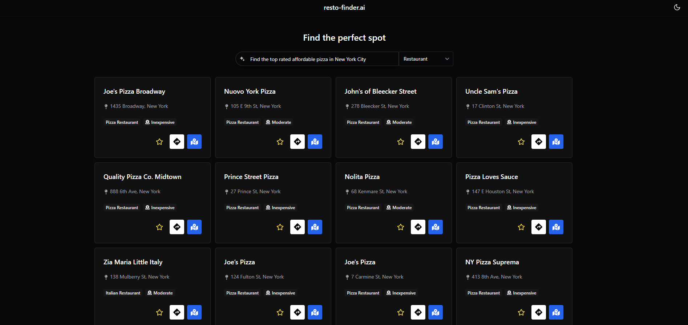

# Restaurant Finder V2



## About 

A full-stack restaurant discovery platform featuring natural language search. This modern evolution of [Restaurant Finder](https://github.com/jeremejazz/restaurant-finder) migrates the backend to Fastify for high performance, integrates a new search service, and introduces a dedicated frontend interface.


## Project Setup


### Pre-Requisites 
- Node 24.xx.xx
- pnpm 10.xx.xx


### Setup

```sh
git clone https://github.com/jeremejazz/resto-finder-v2.git
```

#### Backend Setuo

1. Navigate to the backend directory and install dependencies:

```sh
cd backend
pnpm install
```

2. Configure your environment variables:

```sh
cp .env.example .env
```

3. Edit the .env file and add your API keys and configuration:

```sh
PORT=5000
API_KEY=your_api_key_here
GOOGLE_API_KEY=your_google_api_key_here
GOOGLE_PLACES_API_URL=https://places.googleapis.com/v1/places:searchText
```

4. Start the backend development server:
```
pnpm run dev
```


#### Frontend Setup

1. In a new terminal, navigate to the frontend directory and install dependencies:

```sh
cd frontend
pnpm install
```

2. Configure your environment variables:

```
cp .env.example .env
```

3. Edit the .env file to match your backend URL:

```
VITE_API_URL=http://localhost:5000
VITE_API_KEY=your_api_key_here
```

Make sure the `VITE_API_KEY` matches the `API_KEY` set in your backend .env file.

4. Start the frontend development server:
```
pnpm run dev
```

The frontend will start on `http://localhost:5173` (default Vite port).
